# TỔNG QUAN HỆ THỐNG BLOG SYSTEM

Tài liệu này cung cấp một cái nhìn tổng quát, toàn diện về kiến trúc công nghệ, các ca sử dụng (Use Cases), sơ đồ thiết kế cơ sở dữ liệu chi tiết, các luồng hoạt động chính và tổng quát toàn bộ mã nguồn Backend của hệ thống **Blog (Spring Boot + MySQL + React/Vite)**.

---

## 📋 Mục lục
1. [1. Giới thiệu chung](#1-giới-thiệu-chung)
2. [2. Kiến trúc Công nghệ (Tech Stack)](#2-kiến-trúc-công-nghệ-tech-stack)
3. [3. Sơ đồ Use Case (Use Case Diagram)](#3-sơ-đồ-use-case-use-case-diagram)
4. [4. Đặc tả Ca sử dụng (Use Case Specifications)](#4-đặc-tả-ca-sử-dụng-use-case-specifications)
   - [Bảng 2.1: Quản lí người dùng](#bảng-21-đặc-tả-ca-sử-dụng-quản-lí-người-dùng)
   - [Bảng 2.2: Tạo bài viết](#bảng-22-đặc-tả-ca-sử-dụng-tạo-bài-viết)
   - [Bảng 2.3: Đọc bài viết](#bảng-23-đặc-tả-ca-sử-dụng-đọc-bài-viết)
   - [Bảng 2.4: Bình luận bài viết](#bảng-24-đặc-tả-ca-sử-dụng-bình-luận-bài-viết)
   - [Bảng 2.5: Xóa bài viết](#bảng-25-đặc-tả-ca-sử-dụng-xóa-bài-viết)
   - [Bảng 2.6: Cập nhật bài viết](#bảng-26-đặc-tả-ca-sử-dụng-cập-nhật-bài-viết)
   - [Bảng 2.7: Quản lí profile cá nhân](#bảng-27-đặc-tả-ca-sử-dụng-quản-lí-profile-cá-nhân)
5. [5. Sơ đồ Cơ sở Dữ liệu Chi tiết (Database Diagram / ERD)](#5-sơ-đồ-cơ-sở-dữ-liệu-chi-tiết-database-diagram--erd)
6. [6. Các Luồng Hoạt Động (Flowcharts)](#6-các-luồng-hoạt-động-flowcharts)
   - [6.1 Luồng Xác thực & Đăng nhập (Authentication Flow)](#61-luồng-xác-thực--đăng-nhập-authentication-flow)
   - [6.2 Luồng Tương tác của Độc giả (Public & User Flow)](#62-luồng-tương-tác-của-độc-giả-public--user-flow)
   - [6.3 Luồng Quản trị viên (Admin Management Flow)](#63-luồng-quản-trị-viên-admin-management-flow)
7. [7. Tổng quát các File Backend (Chi tiết mã nguồn)](#7-tổng-quát-các-file-backend-chi-tiết-mã-nguồn)
8. [8. Tổng quát các File Frontend (Chi tiết mã nguồn)](#8-tổng-quát-các-file-frontend-chi-tiết-mã-nguồn)

---

## 1. Giới thiệu chung

Hệ thống **Blog System** là một ứng dụng web cho phép người dùng đọc bài viết, tìm kiếm thông tin, để lại bình luận và giúp quản trị viên (Admin) quản lý nội dung số một cách có tổ chức. Hệ thống được phát triển theo mô hình tách biệt hoàn toàn giữa **Backend** (API Service) và **Frontend** (Client Application).

- **Phía Độc giả (Public & User)**: Xem danh sách bài viết theo thời gian, lọc bài viết theo danh mục (Category), tìm kiếm từ khóa, quản lý thông tin cá nhân và viết bình luận dưới các bài viết.
- **Phía Quản trị viên (Admin)**: Quản lý toàn bộ danh mục, quản lý bài viết (bao gồm lưu nháp hoặc xuất bản bài viết công khai), kiểm duyệt bình luận, quản lý phân quyền thành viên và theo dõi thống kê số liệu qua màn hình Dashboard.

---

## 2. Kiến trúc Công nghệ (Tech Stack)

Hệ thống được thiết kế theo kiến trúc 3 lớp (3-Tier Architecture) vững chắc và dễ mở rộng:

```
┌─────────────────┐          HTTP REST APIs          ┌───────────────────┐          Spring JDBC / JPA          ┌──────────────┐
│  React Frontend │ ◄──────────────────────────────► │ Spring Boot App   │ ◄───────────────────────────────► │ MySQL DB     │
│  (Vite + React) │   Session Cookies (JSESSIONID)   │ (Spring Security) │                                   │ (Schema:blog)│
└─────────────────┘                                  └───────────────────┘                                   └──────────────┘
```

### Chi tiết các công nghệ sử dụng:
* **Frontend**:
  * **Framework**: React.js được khởi tạo và build bằng **Vite** nhằm tối ưu hóa hiệu suất và tốc độ load trang.
  * **API Client**: Sử dụng API `fetch` gốc của trình duyệt (hoặc Axios) được cấu hình đính kèm `credentials: "include"` để tự động gửi Session Cookie đi kèm.
  * **Styling**: CSS thuần (Vanilla CSS) đem lại sự mượt mà và giao diện hiện đại.
* **Backend**:
  * **Framework**: Java **Spring Boot** quản lý vòng đời ứng dụng và cung cấp các REST API.
  * **Bảo mật (Security)**: **Spring Security** thiết lập cơ chế bảo mật cho các đường dẫn API (`/api/public/**` mở tự do, `/api/user/**` yêu cầu vai trò user đăng nhập, `/api/admin/**` giới hạn quyền Admin).
  * **Xác thực (Authentication)**: Cơ chế **Session-based Authentication** truyền thống. Sau khi đăng nhập thành công, Backend tạo Session và gửi về client cookie chứa mã định danh `JSESSIONID`.
  * **Data Access**: **Spring Data JPA (Hibernate)** ánh xạ các đối tượng Java sang cơ sở dữ liệu quan hệ MySQL.
* **Cơ sở dữ liệu (Database)**:
  * **MySQL Database**: Lưu trữ dữ liệu có cấu trúc bao gồm các bảng người dùng, danh mục bài viết, bài viết và bình luận.

---

## 3. Sơ đồ Use Case (Use Case Diagram)

Sơ đồ dưới đây biểu diễn các tác nhân (Actors) và các chức năng hệ thống (Use Cases) tương ứng của **Độc giả/Thành viên** (User) và **Quản trị viên** (Admin):

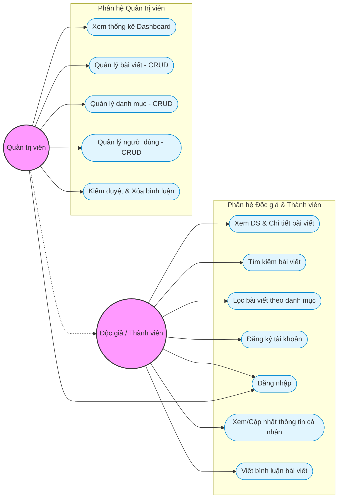

---

## 4. Đặc tả Ca sử dụng (Use Case Specifications)

Phần này trình bày chi tiết đặc tả từng ca sử dụng của hệ thống Blog, được phân tích dựa trên mã nguồn thực tế hiện có.

---

### Bảng 2.1: Đặc tả ca sử dụng Quản lí người dùng

| Mục | Nội dung |
|-----|----------|
| **Tên ca sử dụng** | Quản lí người dùng (User Management) |
| **Mã ca sử dụng** | UC-01 |
| **Tác nhân** | Quản trị viên (Admin) |
| **Mô tả** | Quản trị viên thực hiện quản lý toàn bộ danh sách tài khoản người dùng trong hệ thống, bao gồm xem danh sách, tạo mới, chỉnh sửa thông tin và xóa tài khoản người dùng. |
| **Tiền điều kiện** | - Quản trị viên đã đăng nhập vào hệ thống với tài khoản có quyền Admin (`admin = true`). <br> - Phiên đăng nhập (Session) còn hiệu lực và Cookie `JSESSIONID` hợp lệ. |
| **Hậu điều kiện** | Dữ liệu người dùng trong cơ sở dữ liệu được cập nhật đúng theo thao tác (thêm / sửa / xóa). |
| **Luồng chính (Basic Flow)** | 1. Admin truy cập trang "Quản lý người dùng" trên giao diện Admin. <br> 2. Hệ thống gửi request `GET /api/blog/admin/users` để lấy danh sách tất cả người dùng. <br> 3. Backend trả về danh sách `List<UserResponse>` gồm: `id`, `username`, `email`, `admin`, `createdAt`. <br> 4. Giao diện hiển thị danh sách người dùng dạng bảng (UserPage.jsx). <br> 5. Admin chọn thao tác: **Xem chi tiết**, **Tạo mới**, **Chỉnh sửa** hoặc **Xóa**. |
| **Luồng phụ 1: Tạo mới người dùng** | 1. Admin nhấn nút "Thêm người dùng". <br> 2. Giao diện hiển thị form nhập (UserForm.jsx) gồm: Username, Email, Password, Role (Admin/User). <br> 3. Admin điền thông tin và nhấn "Lưu". <br> 4. Frontend gửi `POST /api/blog/admin/users` với body `UserRequest`. <br> 5. Backend mã hóa password bằng BCrypt, lưu User vào DB và trả về `UserResponse` (HTTP 201). |
| **Luồng phụ 2: Chỉnh sửa người dùng** | 1. Admin nhấn nút "Sửa" bên cạnh một người dùng. <br> 2. Frontend gửi `GET /api/blog/admin/users/{id}` để lấy thông tin chi tiết. <br> 3. Giao diện hiển thị form chỉnh sửa (UserForm.jsx) với dữ liệu đã điền sẵn. <br> 4. Admin sửa thông tin và nhấn "Cập nhật". <br> 5. Frontend gửi `PUT /api/blog/admin/users/{id}` với body `UserRequest`. <br> 6. Backend cập nhật thông tin (mã hóa lại password nếu có thay đổi) và trả về `UserResponse` (HTTP 200). |
| **Luồng phụ 3: Xóa người dùng** | 1. Admin nhấn nút "Xóa" bên cạnh một người dùng. <br> 2. Hệ thống hiển thị xác nhận xóa. <br> 3. Admin xác nhận xóa. <br> 4. Frontend gửi `DELETE /api/blog/admin/users/{id}`. <br> 5. Backend xóa người dùng khỏi DB và trả về thông báo thành công (HTTP 200). |
| **Luồng ngoại lệ** | - Nếu Admin chưa đăng nhập: Backend trả về `401 Unauthorized`. <br> - Nếu tài khoản không có quyền Admin: Backend trả về `403 Forbidden`. <br> - Nếu ID người dùng không tồn tại: Backend ném `ResourceNotFoundException` (HTTP 404). |
| **Giao diện liên quan** | - `UserPage.jsx` — Trang danh sách người dùng. <br> - `UserForm.jsx` — Form thêm/sửa người dùng. |
| **API Endpoint** | - `GET /api/blog/admin/users` <br> - `GET /api/blog/admin/users/{id}` <br> - `POST /api/blog/admin/users` <br> - `PUT /api/blog/admin/users/{id}` <br> - `DELETE /api/blog/admin/users/{id}` |
| **File Backend** | `AdminUserController.java` → `UserService.java` → `UserServiceImpl.java` → `UserRepo.java` |

---

### Bảng 2.2: Đặc tả ca sử dụng Tạo bài viết

| Mục | Nội dung |
|-----|----------|
| **Tên ca sử dụng** | Tạo bài viết (Create Post) |
| **Mã ca sử dụng** | UC-02 |
| **Tác nhân** | Quản trị viên (Admin) |
| **Mô tả** | Quản trị viên tạo một bài viết mới với tiêu đề, nội dung, danh mục và trạng thái xuất bản (nháp hoặc công khai). |
| **Tiền điều kiện** | - Admin đã đăng nhập vào hệ thống (Session hợp lệ). <br> - Phải tồn tại ít nhất một danh mục (Category) trong hệ thống để chọn. |
| **Hậu điều kiện** | - Bài viết mới được lưu vào bảng `posts` trong cơ sở dữ liệu. <br> - Nếu `published = true`, bài viết sẽ hiển thị trên trang Blog công khai. <br> - Nếu `published = false`, bài viết ở trạng thái nháp, chỉ Admin mới thấy. |
| **Luồng chính (Basic Flow)** | 1. Admin truy cập trang "Quản lý bài viết" và nhấn nút "Thêm bài viết mới". <br> 2. Giao diện hiển thị form tạo bài viết (PostForm.jsx) bao gồm các trường: <br> &emsp; - **Tiêu đề** (bắt buộc, tối đa 200 ký tự) <br> &emsp; - **Slug** (tùy chọn, tối đa 220 ký tự — nếu để trống server sẽ tự tạo từ tiêu đề) <br> &emsp; - **Nội dung** (bắt buộc, hỗ trợ HTML) <br> &emsp; - **Danh mục** (chọn từ dropdown, bắt buộc) <br> &emsp; - **Trạng thái xuất bản** (Nháp / Công khai) <br> 3. Admin điền nội dung và nhấn "Lưu bài viết". <br> 4. Frontend validate dữ liệu phía client, sau đó gửi `POST /api/blog/admin/posts` với body `PostRequest`. <br> 5. Backend lấy `authorId` từ Session (không tin dữ liệu từ client), tạo entity `Post` mới thông qua `PostMapper.toEntity()`. <br> 6. Backend lưu bài viết vào DB (`postRepo.save()`) và trả về `PostResponse` (HTTP 201 Created). <br> 7. Giao diện thông báo "Tạo bài viết thành công" và chuyển về trang danh sách. |
| **Luồng ngoại lệ** | - Nếu tiêu đề hoặc nội dung để trống: Backend trả về lỗi validation `@NotBlank` (HTTP 400). <br> - Nếu không chọn danh mục: Backend trả về lỗi `@NotNull` (HTTP 400). <br> - Nếu Category ID không tồn tại: Backend ném `ResourceNotFoundException` (HTTP 404). <br> - Nếu phiên đăng nhập hết hạn: Backend trả về `401 Unauthorized`. |
| **Giao diện liên quan** | - `PostPage.jsx` — Trang danh sách bài viết (Admin). <br> - `PostForm.jsx` — Form tạo/sửa bài viết. |
| **API Endpoint** | `POST /api/blog/admin/posts` |
| **File Backend** | `AdminPostController.java` → `PostService.java` → `PostServiceImpl.java` → `PostRepo.java` → `PostMapper.java` |

---

### Bảng 2.3: Đặc tả ca sử dụng Đọc bài viết

| Mục | Nội dung |
|-----|----------|
| **Tên ca sử dụng** | Đọc bài viết (Read/View Post) |
| **Mã ca sử dụng** | UC-03 |
| **Tác nhân** | Khách truy cập (Guest), Người dùng đã đăng nhập (User), Quản trị viên (Admin) |
| **Mô tả** | Người dùng (bao gồm cả khách chưa đăng nhập) xem danh sách các bài viết đã xuất bản, lọc theo danh mục, tìm kiếm theo từ khóa và xem chi tiết một bài viết cụ thể. |
| **Tiền điều kiện** | - Không yêu cầu đăng nhập (API Public). <br> - Tồn tại ít nhất một bài viết có `published = true` trong cơ sở dữ liệu. |
| **Hậu điều kiện** | Hệ thống hiển thị nội dung bài viết (không thay đổi dữ liệu trong DB). |
| **Luồng chính: Xem danh sách bài viết** | 1. Người dùng truy cập trang Blog. <br> 2. Frontend gửi `GET /api/blog/posts` để lấy danh sách bài viết đã xuất bản. <br> 3. Backend gọi `postRepo.findByPublishedTrueOrderByCreatedAtDesc()` để lấy các bài viết có `published = true`, sắp xếp mới nhất trước. <br> 4. Backend chuyển đổi sang `List<PostResponse>` qua `PostMapper.toResponse()` và trả về (HTTP 200). <br> 5. Giao diện hiển thị danh sách dạng thẻ (PostCard) với phân trang (6 bài/trang). |
| **Luồng phụ 1: Lọc theo danh mục** | 1. Người dùng nhấn chọn một danh mục (ví dụ: "Web Development", "AI"). <br> 2. Frontend gửi `GET /api/blog/posts/category/{categoryId}`. <br> 3. Backend gọi `postRepo.findByPublishedTrueAndCategoryIdOrderByCreatedAtDesc(categoryId)`. <br> 4. Trả về danh sách bài viết thuộc danh mục được chọn. |
| **Luồng phụ 2: Tìm kiếm theo từ khóa** | 1. Người dùng nhập từ khóa vào ô tìm kiếm trên thanh điều hướng hoặc trang Blog. <br> 2. Frontend gửi `GET /api/blog/posts/search?keyword=...`. <br> 3. Backend gọi `postRepo.findByPublishedTrueAndTitleContainingIgnoreCaseOrderByCreatedAtDesc(keyword)`. <br> 4. Trả về danh sách bài viết có tiêu đề chứa từ khóa (không phân biệt hoa thường). |
| **Luồng phụ 3: Xem chi tiết bài viết** | 1. Người dùng nhấn vào tiêu đề hoặc thẻ bài viết. <br> 2. Frontend gửi `GET /api/blog/posts/{id}` hoặc `GET /api/blog/posts/slug/{slug}`. <br> 3. Backend kiểm tra bài viết tồn tại và đã xuất bản (`published = true`). <br> 4. Nếu hợp lệ, trả về `PostResponse` chứa đầy đủ nội dung bài viết. <br> 5. Giao diện hiển thị trang chi tiết (BlogDetailPage) gồm: tiêu đề, tác giả, ngày đăng, thời gian đọc, nội dung bài viết, danh sách bình luận và sidebar bài viết liên quan. |
| **Luồng phụ 4: Xem danh sách danh mục** | 1. Frontend gửi `GET /api/blog/categories`. <br> 2. Backend trả về `List<CategoryResponse>` chứa tất cả danh mục. <br> 3. Giao diện hiển thị các tab lọc danh mục và sidebar danh mục. |
| **Luồng ngoại lệ** | - Nếu ID bài viết không tồn tại: Backend ném `ResourceNotFoundException` (HTTP 404). <br> - Nếu bài viết chưa xuất bản (`published = false`) mà khách truy cập: Backend ném `ResourceNotFoundException` — "Bài viết không tồn tại hoặc chưa được xuất bản". <br> - Nếu slug không khớp: Backend ném `ResourceNotFoundException` (HTTP 404). |
| **Giao diện liên quan** | - `BlogPage` (Blog.jsx) — Trang danh sách bài viết. <br> - `BlogDetailPage` (Blog.jsx) — Trang chi tiết bài viết. <br> - `HomePage` (Home.jsx) — Trang chủ hiển thị bài viết nổi bật. <br> - `PostCard`, `Tag` (SharedUIUser.jsx) — Các component UI dùng chung. |
| **API Endpoint** | - `GET /api/blog/posts` <br> - `GET /api/blog/posts/{id}` <br> - `GET /api/blog/posts/slug/{slug}` <br> - `GET /api/blog/posts/search?keyword=...` <br> - `GET /api/blog/posts/category/{categoryId}` <br> - `GET /api/blog/categories` |
| **File Backend** | `PublicPostController.java` → `PostService.java` → `PostServiceImpl.java` → `PostRepo.java` |

---

### Bảng 2.4: Đặc tả ca sử dụng Bình luận bài viết

| Mục | Nội dung |
|-----|----------|
| **Tên ca sử dụng** | Bình luận bài viết (Comment on Post) |
| **Mã ca sử dụng** | UC-04 |
| **Tác nhân** | Người dùng đã đăng nhập (User) |
| **Mô tả** | Người dùng đã đăng nhập viết bình luận dưới một bài viết đã xuất bản. Bình luận được hiển thị công khai cho tất cả người xem. |
| **Tiền điều kiện** | - Người dùng đã đăng nhập vào hệ thống (Session hợp lệ). <br> - Bài viết đích đã tồn tại và có `published = true`. |
| **Hậu điều kiện** | - Bình luận mới được lưu vào bảng `comments` trong cơ sở dữ liệu, liên kết với `user_id` và `post_id`. <br> - Bình luận hiển thị ngay lập tức trong trang chi tiết bài viết. |
| **Luồng chính (Basic Flow)** | 1. Người dùng đang xem trang chi tiết bài viết (BlogDetailPage). <br> 2. Hệ thống tải danh sách bình luận hiện có của bài viết qua `GET /api/blog/posts/{postId}/comments`. <br> 3. Backend gọi `commentService.findByPostId(postId)` và trả về `List<CommentResponse>` gồm: `id`, `content`, `username`, `createdAt`. <br> 4. Giao diện hiển thị danh sách bình luận với avatar (chữ cái đầu của username), tên người dùng, thời gian và nội dung. <br> 5. Người dùng nhập nội dung bình luận vào ô input và nhấn "Gửi bình luận" (hoặc phím Enter). <br> 6. Frontend gửi `POST /api/blog/user/comments` với body `CommentRequest { content, postId }`. <br> 7. Backend lấy `userId` từ Session (`session.getAttribute("loggedInUser")`), tạo entity `Comment` và lưu vào DB. <br> 8. Backend trả về `CommentResponse` (HTTP 201 Created). <br> 9. Frontend tải lại danh sách bình luận và hiển thị thông báo "Gửi bình luận thành công!". |
| **Luồng phụ: Xem bình luận (không đăng nhập)** | 1. Khách truy cập trang chi tiết bài viết. <br> 2. Hệ thống hiển thị danh sách bình luận (API public: `GET /api/blog/posts/{postId}/comments`). <br> 3. Ô nhập bình luận hiển thị placeholder "Đăng nhập để viết bình luận..." và bị vô hiệu hóa (`disabled`). <br> 4. Nút "Gửi bình luận" bị vô hiệu hóa. |
| **Luồng phụ: Admin kiểm duyệt bình luận** | 1. Admin truy cập trang "Quản lý bình luận" (CommentPage.jsx). <br> 2. Frontend gửi `GET /api/blog/admin/comments` để lấy tất cả bình luận. <br> 3. Admin có thể xóa bình luận vi phạm qua `DELETE /api/blog/admin/comments/{id}`. |
| **Luồng ngoại lệ** | - Nếu người dùng chưa đăng nhập và nhấn "Gửi bình luận": Frontend hiển thị `alert("Bạn cần đăng nhập để gửi bình luận!")`. <br> - Nếu nội dung bình luận trống: Frontend hiển thị `alert("Vui lòng nhập nội dung bình luận!")`. <br> - Nếu Session hết hạn: Backend trả về `401 Unauthorized`. |
| **Giao diện liên quan** | - `BlogDetailPage` (Blog.jsx) — Phần bình luận trong trang chi tiết bài viết. <br> - `CommentPage.jsx` — Trang quản lý bình luận (Admin). |
| **API Endpoint** | - `GET /api/blog/posts/{postId}/comments` (Public — Xem bình luận) <br> - `POST /api/blog/user/comments` (Authenticated — Gửi bình luận) <br> - `GET /api/blog/admin/comments` (Admin — Xem tất cả) <br> - `DELETE /api/blog/admin/comments/{id}` (Admin — Xóa bình luận) |
| **File Backend** | `PublicPostController.java` (xem), `UserCommentController.java` (tạo), `AdminCommentController.java` (quản lý) → `CommentService.java` → `CommentServiceImpl.java` → `CommentRepo.java` |

---

### Bảng 2.5: Đặc tả ca sử dụng Xóa bài viết

| Mục | Nội dung |
|-----|----------|
| **Tên ca sử dụng** | Xóa bài viết (Delete Post) |
| **Mã ca sử dụng** | UC-05 |
| **Tác nhân** | Quản trị viên (Admin) |
| **Mô tả** | Quản trị viên xóa một bài viết khỏi hệ thống. Bài viết sẽ bị xóa vĩnh viễn khỏi cơ sở dữ liệu cùng toàn bộ bình luận liên quan. |
| **Tiền điều kiện** | - Admin đã đăng nhập vào hệ thống (Session hợp lệ, quyền Admin). <br> - Bài viết cần xóa tồn tại trong cơ sở dữ liệu. |
| **Hậu điều kiện** | - Bài viết bị xóa khỏi bảng `posts` trong cơ sở dữ liệu. <br> - Bài viết không còn hiển thị trên trang Blog công khai cũng như trang quản trị. |
| **Luồng chính (Basic Flow)** | 1. Admin truy cập trang "Quản lý bài viết" (PostPage.jsx). <br> 2. Hệ thống hiển thị danh sách tất cả bài viết (cả nháp và đã xuất bản) qua `GET /api/blog/admin/posts`. <br> 3. Admin nhấn nút "Xóa" bên cạnh bài viết muốn xóa. <br> 4. Hệ thống hiển thị hộp thoại xác nhận xóa. <br> 5. Admin xác nhận xóa. <br> 6. Frontend gửi `DELETE /api/blog/admin/posts/{id}`. <br> 7. Backend gọi `postService.deleteById(id)` → `postRepo.deleteById(id)`. <br> 8. Backend trả về `{"message": "Xóa bài viết thành công"}` (HTTP 200). <br> 9. Frontend cập nhật lại danh sách bài viết. |
| **Luồng ngoại lệ** | - Nếu bài viết không tồn tại: Backend có thể ném lỗi từ JPA. <br> - Nếu Admin chưa đăng nhập: Backend trả về `401 Unauthorized`. <br> - Nếu không có quyền Admin: Backend trả về `403 Forbidden`. |
| **Giao diện liên quan** | - `PostPage.jsx` — Trang danh sách bài viết (Admin). |
| **API Endpoint** | `DELETE /api/blog/admin/posts/{id}` |
| **File Backend** | `AdminPostController.java` → `PostService.java` → `PostServiceImpl.java` → `PostRepo.java` |

---

### Bảng 2.6: Đặc tả ca sử dụng Cập nhật bài viết

| Mục | Nội dung |
|-----|----------|
| **Tên ca sử dụng** | Cập nhật bài viết (Update Post) |
| **Mã ca sử dụng** | UC-06 |
| **Tác nhân** | Quản trị viên (Admin) |
| **Mô tả** | Quản trị viên chỉnh sửa thông tin của một bài viết đã tồn tại, bao gồm tiêu đề, slug, nội dung, danh mục và trạng thái xuất bản. |
| **Tiền điều kiện** | - Admin đã đăng nhập vào hệ thống (Session hợp lệ, quyền Admin). <br> - Bài viết cần chỉnh sửa tồn tại trong cơ sở dữ liệu. |
| **Hậu điều kiện** | - Thông tin bài viết trong bảng `posts` được cập nhật theo nội dung mới. <br> - Nếu trạng thái thay đổi từ nháp sang công khai, bài viết sẽ hiển thị trên trang Blog. <br> - Nếu trạng thái thay đổi từ công khai sang nháp, bài viết sẽ bị ẩn khỏi trang Blog. |
| **Luồng chính (Basic Flow)** | 1. Admin truy cập trang "Quản lý bài viết" (PostPage.jsx). <br> 2. Admin nhấn nút "Sửa" bên cạnh bài viết muốn chỉnh sửa. <br> 3. Frontend gửi `GET /api/blog/admin/posts/{id}` để lấy thông tin chi tiết bài viết. <br> 4. Giao diện hiển thị form chỉnh sửa (PostForm.jsx) với dữ liệu đã điền sẵn: <br> &emsp; - Tiêu đề <br> &emsp; - Slug <br> &emsp; - Nội dung (HTML) <br> &emsp; - Danh mục (dropdown) <br> &emsp; - Trạng thái xuất bản (checkbox hoặc toggle) <br> 5. Admin sửa nội dung cần thay đổi và nhấn "Cập nhật bài viết". <br> 6. Frontend gửi `PUT /api/blog/admin/posts/{id}` với body `PostRequest` đã cập nhật. <br> 7. Backend tìm bài viết theo ID, cập nhật các trường qua `PostMapper.updateEntity()`, lưu lại vào DB. <br> 8. Backend trả về `PostResponse` đã cập nhật (HTTP 200). <br> 9. Giao diện thông báo "Cập nhật bài viết thành công" và chuyển về trang danh sách. |
| **Luồng ngoại lệ** | - Nếu bài viết không tồn tại: Backend ném `ResourceNotFoundException` (HTTP 404). <br> - Nếu tiêu đề hoặc nội dung để trống: Backend trả về lỗi validation (HTTP 400). <br> - Nếu phiên đăng nhập hết hạn: Backend trả về `401 Unauthorized`. |
| **Giao diện liên quan** | - `PostPage.jsx` — Trang danh sách bài viết (Admin). <br> - `PostForm.jsx` — Form tạo/sửa bài viết. |
| **API Endpoint** | - `GET /api/blog/admin/posts/{id}` (lấy dữ liệu) <br> - `PUT /api/blog/admin/posts/{id}` (cập nhật) |
| **File Backend** | `AdminPostController.java` → `PostService.java` → `PostServiceImpl.java` → `PostRepo.java` → `PostMapper.java` |

---

### Bảng 2.7: Đặc tả ca sử dụng Quản lí profile cá nhân

| Mục | Nội dung |
|-----|----------|
| **Tên ca sử dụng** | Quản lí profile cá nhân (Manage Personal Profile) |
| **Mã ca sử dụng** | UC-07 |
| **Tác nhân** | Người dùng đã đăng nhập (User) |
| **Mô tả** | Người dùng đã đăng nhập xem và chỉnh sửa thông tin cá nhân của mình, bao gồm tên người dùng, email và mật khẩu. |
| **Tiền điều kiện** | - Người dùng đã đăng nhập vào hệ thống (Session hợp lệ). <br> - Cookie `JSESSIONID` hợp lệ và chưa hết hạn. |
| **Hậu điều kiện** | - Thông tin cá nhân trong bảng `users` được cập nhật theo nội dung mới. <br> - Session được cập nhật lại với thông tin mới nhất từ DB. |
| **Luồng chính: Xem profile** | 1. Người dùng nhấn vào avatar hoặc menu "Trang cá nhân" trên thanh điều hướng. <br> 2. Frontend gửi `GET /api/blog/user/profile`. <br> 3. Backend lấy `userId` từ Session (`session.getAttribute("loggedInUser")`), tìm User trong DB và trả về `UserResponse` gồm: `id`, `username`, `email`, `admin`, `createdAt`. <br> 4. Giao diện hiển thị trang Profile (ProfilePage.jsx) gồm: <br> &emsp; - Banner gradient với avatar (chữ cái đầu) <br> &emsp; - Tên người dùng, email <br> &emsp; - Badge vai trò (Quản trị viên / Người dùng) <br> &emsp; - Ngày tham gia hệ thống <br> &emsp; - Card thông tin tài khoản (readonly) <br> &emsp; - Nút "Chỉnh sửa" và nút "Đăng xuất" |
| **Luồng phụ: Chỉnh sửa profile** | 1. Người dùng nhấn nút "Chỉnh sửa". <br> 2. Giao diện chuyển sang chế độ chỉnh sửa, hiển thị form gồm: <br> &emsp; - **Tên người dùng** (input text, giá trị hiện tại đã điền sẵn) <br> &emsp; - **Email** (input email, giá trị hiện tại đã điền sẵn) <br> &emsp; - **Mật khẩu mới** (input password, có ghi chú "bỏ trống nếu không đổi") <br> 3. Người dùng sửa thông tin và nhấn "Lưu thay đổi". <br> 4. Frontend gửi `PUT /api/blog/user/profile` với body `UpdateProfileRequest { username, email, password }`. <br> 5. Backend lấy `userId` từ Session, tìm User, cập nhật các trường qua `UserMapper.updateProfile()`. <br> 6. Nếu có mật khẩu mới, Backend mã hóa bằng `BCryptPasswordEncoder` trước khi lưu. <br> 7. Backend lưu User đã cập nhật vào DB. <br> 8. Backend load lại User từ DB và cập nhật Session (`session.setAttribute("loggedInUser", updatedUser)`). <br> 9. Backend trả về `UserResponse` đã cập nhật (HTTP 200). <br> 10. Giao diện hiển thị thông báo "Cập nhật thông tin thành công!", chuyển về chế độ xem. |
| **Luồng phụ: Hủy chỉnh sửa** | 1. Trong chế độ chỉnh sửa, người dùng nhấn nút "Hủy". <br> 2. Giao diện khôi phục lại giá trị ban đầu và chuyển về chế độ xem (readonly). |
| **Luồng phụ: Đăng xuất** | 1. Người dùng nhấn nút "Đăng xuất" ở cuối trang Profile. <br> 2. Frontend gửi `POST /api/auth/logout`. <br> 3. Backend xóa SecurityContext và hủy Session (`session.invalidate()`). <br> 4. Frontend xóa thông tin user phía client và chuyển về trang chủ. |
| **Luồng ngoại lệ** | - Nếu người dùng chưa đăng nhập: Giao diện hiển thị thông báo "Bạn chưa đăng nhập" với nút "Quay về trang chủ" (không gọi API). <br> - Nếu Session hết hạn khi gửi API: Backend trả về `401 Unauthorized`. <br> - Nếu cập nhật thất bại: Giao diện hiển thị thông báo lỗi. |
| **Giao diện liên quan** | - `ProfilePage.jsx` — Trang thông tin cá nhân. <br> - `SharedUIUser.jsx` — NavBar chứa link đến trang Profile. |
| **API Endpoint** | - `GET /api/blog/user/profile` (Xem profile) <br> - `PUT /api/blog/user/profile` (Cập nhật profile) <br> - `POST /api/auth/logout` (Đăng xuất) |
| **File Backend** | `UserProfileController.java` → `UserService.java` → `UserServiceImpl.java` → `UserRepo.java` → `UserMapper.java` |

---

### Tổng hợp Ma trận Tác nhân — Ca sử dụng

| Ca sử dụng | Khách (Guest) | Người dùng (User) | Quản trị viên (Admin) |
|:----------:|:-------------:|:------------------:|:---------------------:|
| UC-01: Quản lí người dùng | ✗ | ✗ | ✓ |
| UC-02: Tạo bài viết | ✗ | ✗ | ✓ |
| UC-03: Đọc bài viết | ✓ | ✓ | ✓ |
| UC-04: Bình luận bài viết | ✗ | ✓ | ✓ |
| UC-05: Xóa bài viết | ✗ | ✗ | ✓ |
| UC-06: Cập nhật bài viết | ✗ | ✗ | ✓ |
| UC-07: Quản lí profile cá nhân | ✗ | ✓ | ✓ |

> **Ghi chú**: Admin thừa hưởng tất cả quyền của User thông thường (đọc bài viết, bình luận, quản lý profile).

---

## 5. Sơ đồ Cơ sở Dữ liệu Chi tiết (Database Diagram / ERD)

Dưới đây là sơ đồ thiết kế cơ sở dữ liệu quan hệ (Physical Database Schema Diagram) mô tả chi tiết các trường, kiểu dữ liệu thực tế trong MySQL, khóa chính (PK), khóa ngoại (FK) và mối quan hệ giữa các bảng:

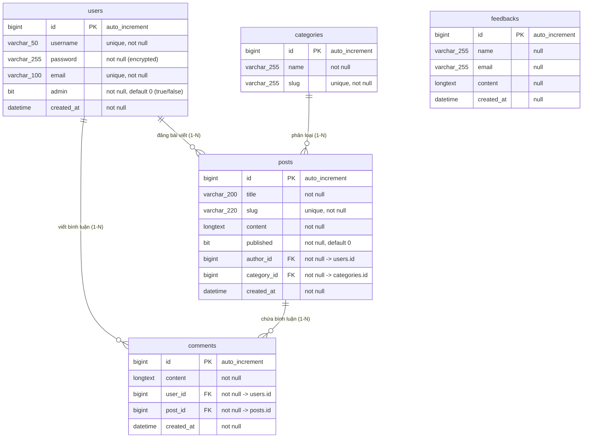

---

## 5. Các Luồng Hoạt Động (Flowcharts & Sequence Diagrams)

Để hiểu rõ cách thức vận hành từ tổng quát đến chi tiết, các luồng hoạt động lớn trong hệ thống được phân tích bằng cả biểu đồ luồng nghiệp vụ (Flowchart) lẫn các biểu đồ tuần tự chi tiết (Sequence Diagram) tương tác giữa **Frontend (React)**, **Security/Config**, **Controller**, **Service**, **Repository** và **Database (MySQL)**.

---

### 5.1 Luồng Xác thực & Đăng nhập (Authentication Flow)

Mô tả cách hệ thống tiếp nhận yêu cầu đăng ký/đăng nhập của người dùng, cấp phát Session qua Cookie và kiểm soát quyền truy cập đối với các API bảo mật.

#### A. Sơ đồ Luồng Tổng quát (High-level Flowchart)
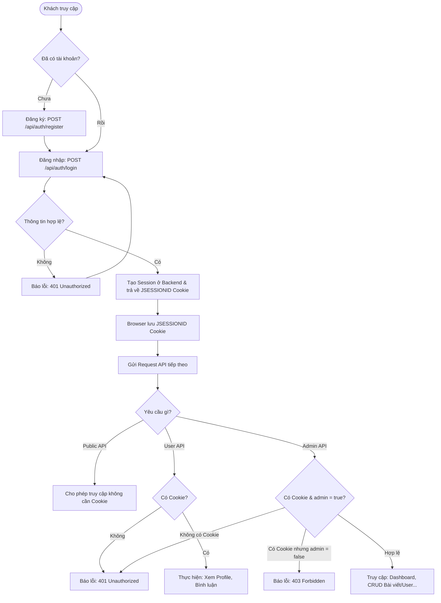

#### Mô tả Hoạt động Chi tiết:
1. **Đăng ký & Đăng nhập (Khởi đầu)**: Khách truy cập tiếp cận hệ thống và hệ thống kiểm tra xem họ **Đã có tài khoản hay chưa?**
   * **Nếu chưa có**: Khách được dẫn tới trang Đăng ký tài khoản gửi request `POST /api/auth/register`. Sau khi đăng ký thành công, họ chuyển đến bước Đăng nhập.
   * **Nếu đã có**: Khách thực hiện Đăng nhập bằng cách gửi Username & Mật khẩu thông qua request `POST /api/auth/login`.
2. **Xác thực thông tin tại Backend**: Backend kiểm tra **Thông tin đăng nhập có hợp lệ không?** (so khớp với dữ liệu đã mã hóa BCrypt trong database).
   * **Nếu thông tin sai (Không)**: Hệ thống ném lỗi xác thực `401 Unauthorized` và yêu cầu người dùng đăng nhập lại.
   * **Nếu thông tin đúng (Có)**: Backend tạo một phiên làm việc (Session) mới cho người dùng, lưu SecurityContext và loggedInUser vào `HttpSession`, đồng thời trình duyệt của người dùng (Browser) tự động lưu trữ Cookie chứa mã phiên `JSESSIONID` cho các yêu cầu tiếp theo.
3. **Điều hướng & Kiểm soát quyền truy cập API**: Mỗi khi người dùng gửi một request tiếp theo, trình duyệt sẽ tự động đính kèm Cookie `JSESSIONID` đi kèm. Hệ thống sẽ kiểm tra xem request đó thuộc nhóm API nào:
   * **Nhóm 1: Yêu cầu Public API (Công khai)**: Hệ thống **cho phép truy cập ngay lập tức** mà không cần kiểm tra Cookie (Ví dụ: Đọc bài viết, xem danh mục).
   * **Nhóm 2: Yêu cầu User API (Thành viên)**: Hệ thống kiểm tra **Có Cookie hợp lệ hay không?** Nếu có $\rightarrow$ Cho phép thực hiện thao tác (Bình luận, xem Profile). Nếu không có $\rightarrow$ Trả về lỗi `401 Unauthorized`.
   * **Nhóm 3: Yêu cầu Admin API (Quản trị)**: Hệ thống kiểm tra **Có Cookie VÀ tài khoản có quyền `admin = true` hay không?** Nếu không có Cookie $\rightarrow$ Trả về lỗi `401 Unauthorized`. Nếu có Cookie nhưng tài khoản không có quyền Admin (`admin = false`) $\rightarrow$ Trả về lỗi `403 Forbidden`. Nếu Cookie hợp lệ và có quyền Admin $\rightarrow$ Cho phép truy cập toàn bộ trang quản trị Admin và thực hiện các chức năng CRUD nâng cao.

#### B. Luồng chi tiết 1: Đăng ký Tài khoản (User Registration Sub-flow)
Chu trình xử lý từ khi người dùng nhập form đăng ký trên giao diện cho đến khi mật khẩu được mã hóa băm an toàn và lưu trữ vào cơ sở dữ liệu.

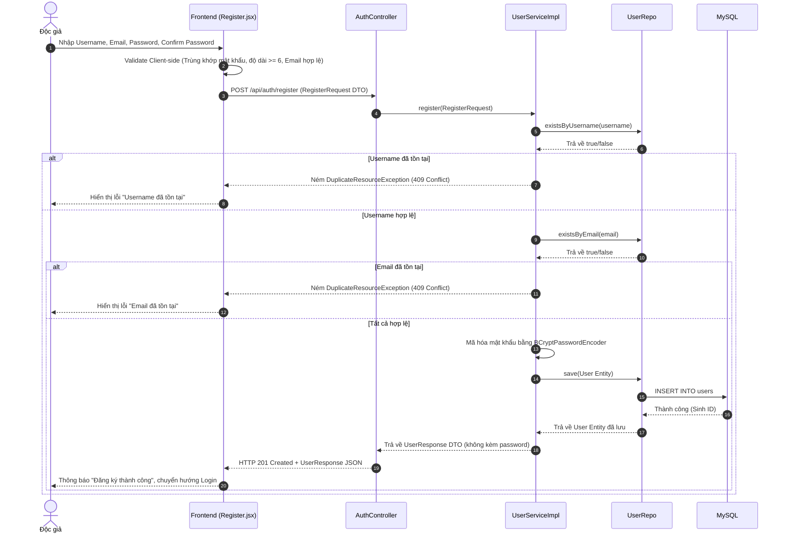

#### C. Luồng chi tiết 2: Đăng nhập & Thiết lập Phiên (Login & Session Sub-flow)
Xử lý xác thực người dùng tích hợp giữa Spring Security và Http Session để phát hành Cookie duy trì trạng thái đăng nhập.

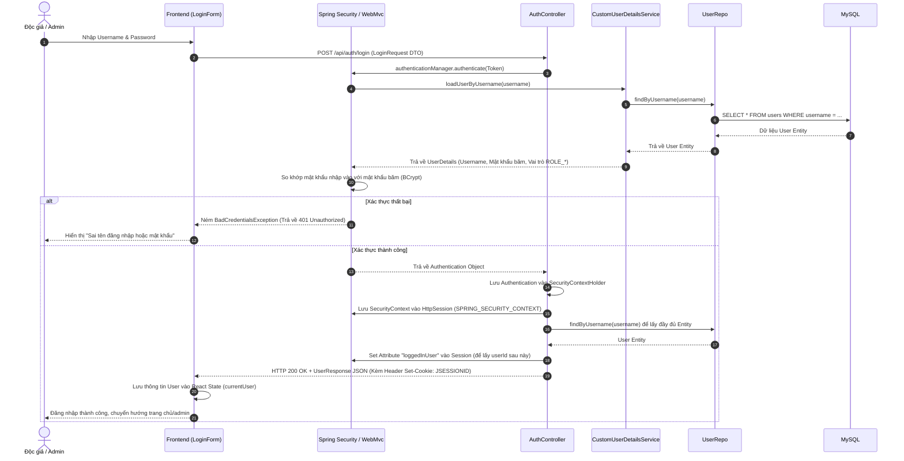

---

### 5.2 Luồng Tương tác của Độc giả (Public & User Flow)

Mô tả hành trình của độc giả khi truy cập trang web để đọc bài viết, tìm kiếm bài viết yêu thích, liên hệ phản hồi và gửi bình luận tương tác.

#### A. Sơ đồ Luồng Tổng quát (High-level Flowchart)
```mermaid
flowchart TD
    User([Người dùng thường]) --> AccessHome[Truy cập Trang chủ]
    AccessHome --> FetchPosts[Lấy danh sách bài viết: GET /api/public/posts]
    AccessHome --> FetchCategories[Lấy danh mục: GET /api/public/categories]
    
    AccessHome --> ActionDecision{Hành động?}
    ActionDecision -- Tìm kiếm --> Search[Tìm bài viết theo Keyword: GET /api/public/posts/search?keyword=...]
    ActionDecision -- Lọc danh mục --> Filter[Lọc bài viết theo Category: GET /api/public/posts/category/{id}]
    ActionDecision -- Xem chi tiết --> ViewDetail[Xem chi tiết bài viết: GET /api/public/posts/{id} hoặc theo slug]
    
    ViewDetail --> FetchComments[Tải danh sách bình luận: GET /api/public/posts/{id}/comments]
    FetchComments --> CommentDecision{Muốn bình luận?}
    CommentDecision -- Có --> CheckAuth{Đã đăng nhập?}
    CheckAuth -- Chưa --> PromptLogin[Yêu cầu Đăng nhập] --> Login[Đăng nhập]
    CheckAuth -- Rồi --> WriteComment[Nhập nội dung & gửi: POST /api/user/comments]
    WriteComment --> SaveCommentDB[Lưu vào Database & hiển thị lên UI]
    CommentDecision -- Không --> End([Kết thúc đọc])
```

#### Mô tả Hoạt động Chi tiết:
1. **Tiếp cận trang chủ (Khởi đầu)**: Người dùng thường truy cập vào trang chủ của Blog. Hệ thống tự động thực hiện 2 request đồng thời dưới nền để tải dữ liệu hiển thị:
   * Tải danh sách bài viết công khai: `GET /api/public/posts`.
   * Tải danh sách các danh mục phân loại: `GET /api/public/categories`.
2. **Lựa chọn hành động**: Từ trang chủ, độc giả có 3 hướng tương tác chính:
   * **Tìm kiếm**: Độc giả nhập từ khóa tìm kiếm $\rightarrow$ Hệ thống gọi API tìm kiếm bài viết theo keyword: `GET /api/public/posts/search?keyword=...` và hiển thị kết quả.
   * **Lọc danh mục**: Độc giả click chọn một danh mục cụ thể $\rightarrow$ Hệ thống gọi API lọc bài viết theo ID danh mục: `GET /api/public/posts/category/{id}`.
   * **Xem chi tiết bài viết (Luồng đọc chính)**: Độc giả click vào bài viết $\rightarrow$ Hệ thống gọi API lấy chi tiết bài viết: `GET /api/public/posts/{id}` (hoặc slug URL). Sau khi bài viết tải xong, hệ thống tiếp tục tải danh sách các bình luận hiện có của bài viết đó: `GET /api/public/posts/{id}/comments`.
3. **Viết bình luận tương tác (Tương tác thành viên)**: Sau khi đọc bài viết và xem các bình luận cũ, độc giả quyết định có muốn viết bình luận mới hay không:
   * **Nếu không muốn**: Kết thúc chu trình đọc bài viết tại đây.
   * **Nếu muốn (Có)**: Hệ thống kiểm tra trạng thái **Đã đăng nhập hay chưa?**
     * *Nếu chưa đăng nhập*: Hệ thống hiển thị modal **yêu cầu Đăng nhập** và hướng người dùng thực hiện Đăng nhập trước.
     * *Nếu đã đăng nhập*: Người dùng nhập nội dung bình luận và nhấn gửi $\rightarrow$ Frontend gửi request `POST /api/user/comments`. Backend liên kết bình luận với tài khoản người dùng từ Session, lưu Database, và cập nhật hiển thị bình luận mới ngay lập tức lên giao diện.

#### B. Luồng chi tiết 1: Bình luận dưới Bài viết (User Commenting Sub-flow)
Mô tả cách thức một thành viên đã đăng nhập gửi bình luận đóng góp ý kiến dưới một bài viết công khai.

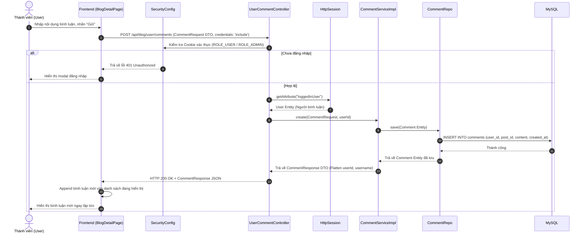

---

#### C. Luồng chi tiết 2: Gửi Ý kiến Phản hồi (Feedback Submission Sub-flow)
Bất kỳ độc giả vãng lai hoặc thành viên nào cũng có thể gửi liên hệ góp ý qua Contact Form.

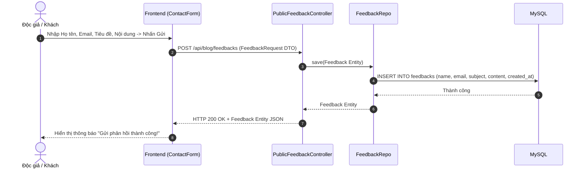

---

### 5.3 Luồng Quản trị viên (Admin Management Flow)

Mô tả cách Admin vận hành, thống kê Dashboard, kiểm duyệt bình luận/phản hồi, quản lý danh mục và đăng tải các bài viết mới.

#### A. Sơ đồ Luồng Tổng quát (High-level Flowchart)
```mermaid
flowchart TD
    Admin([Quản trị viên]) --> AdminLogin[Đăng nhập tài khoản Admin]
    AdminLogin --> AccessAdmin[Truy cập trang Quản trị: /admin]
    AccessAdmin --> GetDashboard[Tải Thống kê Dashboard: GET /api/admin/dashboard]
    AccessAdmin --> MenuDecision{Chọn Menu quản lý}
    
    %% Quản lý bài viết
    MenuDecision -- Quản lý Bài viết --> PostCrud{Hành động?}
    PostCrud -- Xem danh sách --> ViewPosts[GET /api/admin/posts]
    PostCrud -- Tạo bài viết --> CreatePost[POST /api/admin/posts]
    PostCrud -- Sửa bài viết --> UpdatePost[PUT /api/admin/posts/{id}]
    PostCrud -- Xóa bài viết --> DeletePost[DELETE /api/admin/posts/{id}]
    
    %% Quản lý danh mục
    MenuDecision -- Quản lý Danh mục --> CategoryCrud{Hành động?}
    CategoryCrud -- Xem danh sách --> ViewCats[GET /api/admin/categories]
    CategoryCrud -- Tạo mới --> CreateCat[POST /api/admin/categories]
    CategoryCrud -- Sửa --> UpdateCat[PUT /api/admin/categories/{id}]
    CategoryCrud -- Xóa --> DeleteCat[DELETE /api/admin/categories/{id}]
    
    %% Quản lý người dùng
    MenuDecision -- Quản lý Người dùng --> UserCrud{Hành động?}
    UserCrud -- Xem danh sách --> ViewUsers[GET /api/admin/users]
    UserCrud -- Tạo mới --> CreateUser[POST /api/admin/users]
    UserCrud -- Sửa thông tin/Quyền --> UpdateUser[PUT /api/admin/users/{id}]
    UserCrud -- Xóa user --> DeleteUser[DELETE /api/admin/users/{id}]
    
    %% Quản lý bình luận
    MenuDecision -- Quản lý Bình luận --> CommentCrud{Hành động?}
    CommentCrud -- Xem tất cả bình luận --> ViewComments[GET /api/admin/comments]
    CommentCrud -- Xóa bình luận xấu --> DeleteComment[DELETE /api/admin/comments/{id}]
```

#### Mô tả Hoạt động Chi tiết:
1. **Truy cập & Xác thực quyền quản trị (Khởi đầu)**: Quản trị viên đăng nhập vào tài khoản có quyền Admin và truy cập đường dẫn quản trị `/admin`. Hệ thống tự động gửi request nạp số liệu thống kê Dashboard: `GET /api/blog/admin/dashboard`.
2. **Lựa chọn chức năng quản lý**: Từ thanh Sidebar điều hướng, Admin lựa chọn phân hệ quản trị tương ứng:
   * **Quản lý Bài viết**:
     * Xem danh sách bài viết: `GET /api/blog/admin/posts` (tải cả bài đã đăng và bài nháp).
     * Tạo bài viết mới: `POST /api/blog/admin/posts`.
     * Cập nhật thông tin bài viết: `PUT /api/blog/admin/posts/{id}`.
     * Xóa bài viết khỏi hệ thống: `DELETE /api/blog/admin/posts/{id}`.
   * **Quản lý Danh mục**: Thực hiện các yêu cầu nạp danh sách (`GET`), tạo mới (`POST`), sửa (`PUT`) và xóa (`DELETE`) danh mục tại `/api/blog/admin/categories`.
   * **Quản lý Người dùng**: Thực hiện nạp danh sách (`GET`), thêm tài khoản mới (`POST`), đổi quyền/thông tin (`PUT`), và xóa tài khoản (`DELETE`) tại `/api/blog/admin/users`.
   * **Quản lý Bình luận**: Admin tải danh sách bình luận (`GET /api/blog/admin/comments`) để theo dõi kiểm duyệt và xóa các bình luận vi phạm hoặc spam (`DELETE /api/blog/admin/comments/{id}`).
3. **Cơ chế xác thực nền**: Tất cả các yêu cầu trên đều phải đính kèm Session Cookie `JSESSIONID` hợp lệ có quyền `ROLE_ADMIN` được cấu hình bảo vệ tại `SecurityConfig`. Nếu không đủ điều kiện xác thực, hệ thống sẽ trả về lỗi `401 Unauthorized` hoặc `403 Forbidden` và từ chối xử lý.

#### B. Luồng chi tiết 1: Đăng Bài viết Mới (Admin Post Creation Sub-flow)
Mô tả cách thức Admin tạo bài viết mới kèm theo kiểm tra phân quyền và liên kết thông tin tác giả tự động từ phiên làm việc (Session).

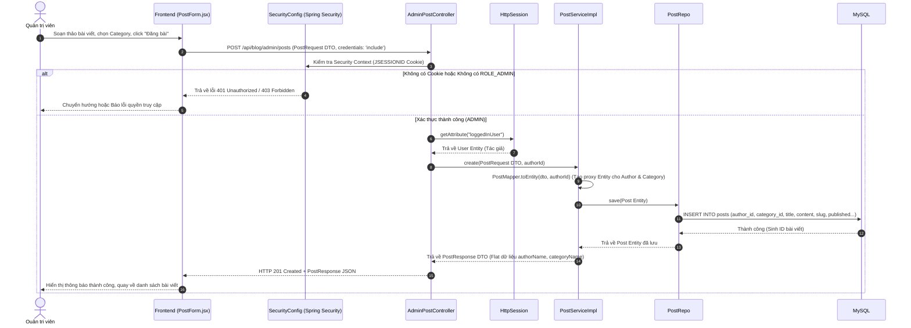

#### C. Luồng chi tiết 2: Xem và Quản lý Phản hồi (Admin Feedback Management)
Quản trị viên tải về danh sách các ý kiến phản hồi đã đóng góp để xem xét và xử lý.

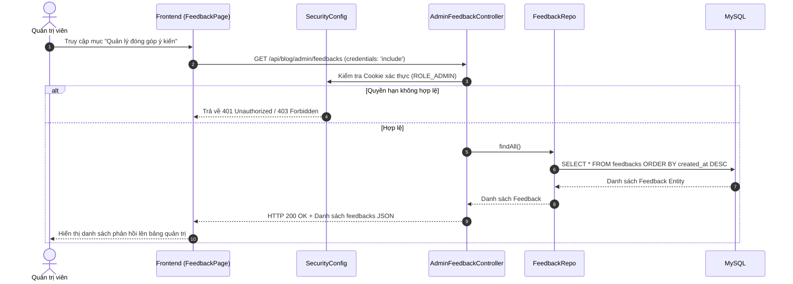

---

## 6. Tổng quát các File Backend (Chi tiết mã nguồn)

Phần này mô tả chi tiết **vai trò** và **cách thức đóng góp** của từng file Java trong mã nguồn Backend Spring Boot. Các file được nhóm theo kiến trúc phân lớp (Layered Architecture) của dự án.

### Sơ đồ kiến trúc phân lớp Backend

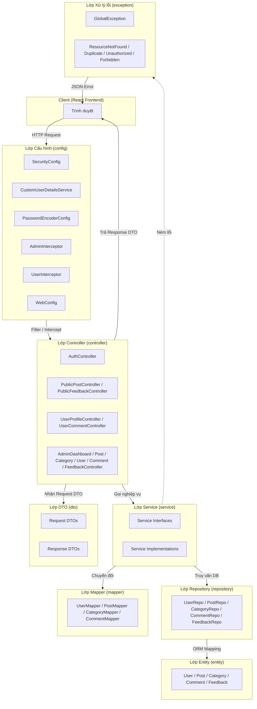

---

### 6.1 File gốc & Cấu hình dự án

| # | File | Vai trò | Đóng góp cho hệ thống |
|---|------|---------|----------------------|
| 1 | `BlogApplication.java` | **Điểm khởi chạy** (Entry Point) của toàn bộ ứng dụng Spring Boot. | Chứa method `main()` với annotation `@SpringBootApplication`, kích hoạt auto-configuration, component scanning và khởi tạo Spring IoC Container. |
| 2 | `build.gradle` | **File cấu hình build** của Gradle. | Khai báo toàn bộ dependencies (Spring Boot Starter Web, JPA, Security, Validation, Lombok, MySQL Connector, DevTools) và phiên bản Java 17. |
| 3 | `application.properties` | **File cấu hình runtime** của Spring Boot. | Thiết lập kết nối database MySQL (`localhost:3377/blog`), cấu hình Hibernate dialect, DDL auto-update và hiển thị SQL log. |

---

### 6.2 Lớp Cấu hình (Package `config`)

Các file trong package này đảm nhận việc thiết lập bảo mật, xác thực và cấu hình web cho toàn bộ ứng dụng.

| # | File | Vai trò | Đóng góp cho hệ thống |
|---|------|---------|----------------------|
| 4 | `SecurityConfig.java` | **Cấu hình bảo mật trung tâm** của Spring Security. | Định nghĩa `SecurityFilterChain` phân quyền truy cập API: `/api/auth/**` (public), `/api/blog/admin/**` (chỉ ADMIN), `/api/blog/user/**` (cần đăng nhập), `/api/blog/**` (public). Cấu hình CORS cho phép Frontend (`localhost:5173`, `5174`, `3000`) gửi request kèm cookie. Thiết lập xử lý lỗi 401/403 trả về JSON. Giới hạn tối đa 1 session/user. |
| 5 | `CustomUserDetailsService.java` | **Cầu nối giữa Spring Security và database User**. | Implement interface `UserDetailsService`, load thông tin user từ DB theo username. Gán vai trò `ROLE_ADMIN` hoặc `ROLE_USER` dựa trên trường `admin` của entity. Được Spring Security gọi tự động khi xác thực đăng nhập. |
| 6 | `PasswordEncoderConfig.java` | **Cấu hình mã hóa mật khẩu**. | Đăng ký bean `BCryptPasswordEncoder` vào Spring Container. Được inject vào `UserServiceImpl` để mã hóa password trước khi lưu DB và so sánh password khi đăng nhập. |
| 7 | `AdminInterceptor.java` | **Bộ chặn (Interceptor) kiểm tra quyền Admin** ở tầng MVC. | Kiểm tra session có chứa user đã đăng nhập và user đó có `admin = true` hay không. Nếu không đủ quyền, trả về HTTP 401 kèm thông báo JSON. Hoạt động như lớp bảo vệ bổ sung bên cạnh Spring Security. |
| 8 | `UserInterceptor.java` | **Bộ chặn kiểm tra trạng thái đăng nhập** ở tầng MVC. | Kiểm tra session có chứa user đã đăng nhập hay chưa. Nếu chưa đăng nhập, trả về HTTP 401. Bảo vệ các API yêu cầu xác thực user thường. |
| 9 | `WebConfig.java` | **Cấu hình MVC mở rộng** (hiện tại để trống). | Implement `WebMvcConfigurer`, dự phòng cho việc thêm interceptor, resource handler hoặc cấu hình MVC khác trong tương lai. CORS và phân quyền đã chuyển sang `SecurityConfig`. |

---

### 6.3 Lớp Entity (Package `entity`)

Các file trong package này ánh xạ trực tiếp tới các bảng trong cơ sở dữ liệu MySQL thông qua JPA/Hibernate.

| # | File | Vai trò | Đóng góp cho hệ thống |
|---|------|---------|----------------------|
| 10 | `User.java` | **Entity đại diện bảng `users`**. | Lưu trữ thông tin tài khoản: `id`, `username` (unique), `password` (mã hóa BCrypt), `email` (unique), `admin` (boolean phân quyền), `createdAt` (tự động gán qua `@PrePersist`). Là thực thể trung tâm liên kết tới Post (tác giả) và Comment (người bình luận). |
| 11 | `Post.java` | **Entity đại diện bảng `posts`**. | Lưu trữ nội dung bài viết: `title`, `slug` (URL thân thiện), `content` (LONGTEXT), `published` (nháp/công khai). Có quan hệ `@ManyToOne` tới `User` (tác giả) và `Category` (danh mục), sử dụng `FetchType.LAZY` để tối ưu hiệu suất truy vấn. |
| 12 | `Category.java` | **Entity đại diện bảng `categories`**. | Lưu trữ danh mục phân loại bài viết: `name` (unique), `slug` (URL thân thiện, unique). Là thực thể cha trong quan hệ 1-N với Post. |
| 13 | `Comment.java` | **Entity đại diện bảng `comments`**. | Lưu trữ nội dung bình luận của người dùng dưới bài viết. Có quan hệ `@ManyToOne` tới cả `User` (người viết) và `Post` (bài viết được bình luận). |
| 14 | `Feedback.java` | **Entity đại diện bảng `feedbacks`**. | Lưu trữ phản hồi/liên hệ từ khách truy cập: `name`, `email`, `subject`, `content`. Là thực thể độc lập, không liên kết tới bảng khác. |

---

### 6.4 Lớp DTO — Request (Package `dto/Request`)

Các file DTO Request định nghĩa cấu trúc dữ liệu mà Frontend gửi lên Backend. Sử dụng annotation `@Valid` (Bean Validation) để kiểm tra dữ liệu đầu vào tự động.

| # | File | Vai trò | Đóng góp cho hệ thống |
|---|------|---------|----------------------|
| 15 | `LoginRequest.java` | **DTO nhận dữ liệu đăng nhập**. | Chứa `username` và `password` kèm validation (không được rỗng). Được `AuthController` sử dụng để truyền vào `AuthenticationManager`. |
| 16 | `RegisterRequest.java` | **DTO nhận dữ liệu đăng ký tài khoản**. | Chứa `username`, `password`, `comfirmPassword`, `email` kèm validation (password tối thiểu 6 ký tự, email đúng định dạng). Được `AuthController` và `UserServiceImpl.register()` xử lý. |
| 17 | `PostRequest.java` | **DTO nhận dữ liệu tạo/sửa bài viết**. | Chứa `title`, `slug`, `content`, `published`, `categoryId`. Được `AdminPostController` và `PostServiceImpl` sử dụng để tạo hoặc cập nhật bài viết. |
| 18 | `CategoryRequest.java` | **DTO nhận dữ liệu tạo/sửa danh mục**. | Chứa `name`, `slug`. Được `AdminCategoryController` xử lý CRUD danh mục. |
| 19 | `CommentRequest.java` | **DTO nhận dữ liệu tạo bình luận**. | Chứa `content`, `postId`. Được `UserCommentController` xử lý khi user gửi bình luận mới. |
| 20 | `UserRequest.java` | **DTO nhận dữ liệu tạo/sửa user (bởi Admin)**. | Chứa `username`, `password`, `email`, `admin` (boolean). Cho phép Admin tạo user mới hoặc thay đổi quyền (user ↔ admin). |
| 21 | `UpdateProfileRequest.java` | **DTO nhận dữ liệu cập nhật thông tin cá nhân**. | Chứa `username`, `email`, `password` (tùy chọn). Được `UserProfileController` xử lý khi user tự cập nhật profile. |
| 22 | `FeedbackRequest.java` | **DTO nhận dữ liệu phản hồi/liên hệ**. | Chứa `name`, `email`, `subject`, `content`. Được `PublicFeedbackController` xử lý khi khách gửi phản hồi. |

---

### 6.5 Lớp DTO — Response (Package `dto/Response`)

Các file DTO Response định nghĩa cấu trúc dữ liệu Backend trả về cho Frontend, đảm bảo không lộ thông tin nhạy cảm (password, internal state).

| # | File | Vai trò | Đóng góp cho hệ thống |
|---|------|---------|----------------------|
| 23 | `UserResponse.java` | **DTO trả về thông tin user** (không chứa password). | Chứa `id`, `username`, `email`, `admin`, `createdAt`. Được trả về trong tất cả API liên quan tới user. |
| 24 | `PostResponse.java` | **DTO trả về thông tin bài viết** (đã flatten quan hệ). | Chứa `id`, `title`, `slug`, `content`, `published`, `createdAt`, `authorId`, `authorName`, `categoryId`, `categoryName`. Giúp Frontend hiển thị đầy đủ thông tin mà không cần gọi thêm API phụ. |
| 25 | `CategoryResponse.java` | **DTO trả về thông tin danh mục**. | Chứa `id`, `name`, `slug`. Được trả về khi xem danh sách hoặc chi tiết danh mục. |
| 26 | `CommentResponse.java` | **DTO trả về thông tin bình luận** (kèm thông tin người viết). | Chứa `id`, `content`, `createdAt`, `userId`, `username`, `postId`. Giúp Frontend hiển thị tên người bình luận mà không cần query thêm. |
| 27 | `DashboardResponse.java` | **DTO trả về số liệu thống kê** cho trang Dashboard Admin. | Chứa `totalPosts`, `publishedPosts`, `draftPosts`, `totalCategories`, `totalComments`, `totalUsers`. Được `AdminDashboardController` tổng hợp từ nhiều Service. |
| 28 | `ErrorResponse.java` | **DTO chuẩn hóa phản hồi lỗi** toàn hệ thống. | Chứa `status`, `error`, `message`, `timestamp`. Được `GlobalException` sử dụng để trả về lỗi dưới dạng JSON thống nhất cho mọi loại exception. |

---

### 6.6 Lớp Mapper (Package `mapper`)

Các file Mapper đảm nhận việc chuyển đổi (mapping) giữa các lớp Entity ↔ DTO, tách biệt logic chuyển đổi ra khỏi Service.

| # | File | Vai trò | Đóng góp cho hệ thống |
|---|------|---------|----------------------|
| 29 | `UserMapper.java` | **Chuyển đổi User Entity ↔ DTO**. | Cung cấp các phương thức static: `toResponse(User)` (entity → response, ẩn password), `toEntity(UserRequest)` (request → entity, dùng khi Admin tạo user), `toEntityFromRegister(RegisterRequest)` (request → entity, dùng khi đăng ký), `updateEntity(User, UserRequest)` và `updateProfile(User, UpdateProfileRequest)` (cập nhật entity từ request). |
| 30 | `PostMapper.java` | **Chuyển đổi Post Entity ↔ DTO**. | Cung cấp: `toResponse(Post)` — flatten quan hệ Author và Category thành `authorId/authorName` và `categoryId/categoryName`; `toEntity(PostRequest, authorId)` — tạo entity mới với proxy User/Category (chỉ cần ID); `updateEntity(Post, PostRequest)` — cập nhật entity mà **không thay đổi tác giả gốc**. |
| 31 | `CategoryMapper.java` | **Chuyển đổi Category Entity ↔ DTO**. | Cung cấp: `toResponse(Category)`, `toEntity(CategoryRequest)`, `updateEntity(Category, CategoryRequest)`. |
| 32 | `CommentMapper.java` | **Chuyển đổi Comment Entity ↔ DTO**. | Cung cấp: `toResponse(Comment)` — flatten thông tin user (userId, username) và postId; `toEntity(CommentRequest, userId)` — tạo entity bình luận mới gắn với user và post. |

---

### 6.7 Lớp Repository (Package `repository`)

Các file Repository kế thừa `JpaRepository` của Spring Data JPA, tự động cung cấp các phương thức CRUD cơ bản và cho phép khai báo các query tùy chỉnh theo quy ước đặt tên.

| # | File | Vai trò | Đóng góp cho hệ thống |
|---|------|---------|----------------------|
| 33 | `UserRepo.java` | **Truy vấn bảng `users`**. | Cung cấp thêm: `findByUsername(String)` (dùng khi đăng nhập), `existsByUsername(String)` và `existsByEmail(String)` (kiểm tra trùng lặp khi đăng ký). |
| 34 | `PostRepo.java` | **Truy vấn bảng `posts`**. | Cung cấp thêm: `findAllByOrderByCreatedAtDesc()` (tất cả bài, sắp xếp mới nhất), `findByPublishedTrueOrderByCreatedAtDesc()` (bài đã đăng), `findByPublishedTrueAndCategoryIdOrderByCreatedAtDesc(Long)` (lọc theo danh mục), `findByPublishedTrueAndTitleContainingIgnoreCaseOrderByCreatedAtDesc(String)` (tìm kiếm theo tiêu đề), `findBySlugAndPublishedTrue(String)` (tìm theo slug), `countByPublishedTrue()` / `countByPublishedFalse()` (thống kê). |
| 35 | `CategoryRepo.java` | **Truy vấn bảng `categories`**. | Kế thừa `JpaRepository<Category, Long>`, tự động có `findAll()`, `findById()`, `save()`, `deleteById()`, `count()`. |
| 36 | `CommentRepo.java` | **Truy vấn bảng `comments`**. | Cung cấp thêm: `findByPostIdOrderByCreatedAtDesc(Long)` (lấy bình luận theo bài viết, sắp xếp mới nhất). |
| 37 | `FeedbackRepo.java` | **Truy vấn bảng `feedbacks`**. | Kế thừa `JpaRepository<Feedback, Long>`, tự động có các phương thức CRUD chuẩn. |

---

### 6.8 Lớp Service — Interface (Package `service`)

Các file Service Interface định nghĩa "hợp đồng" (contract) của tầng nghiệp vụ. Cho phép thay đổi implementation mà không ảnh hưởng tới Controller.

| # | File | Vai trò | Đóng góp cho hệ thống |
|---|------|---------|----------------------|
| 38 | `UserService.java` | **Interface nghiệp vụ quản lý User**. | Khai báo các phương thức: `login()`, `register()`, `findAll()`, `findById()`, `create()`, `update()`, `updateProfile()`, `deleteById()`, `countAll()`. |
| 39 | `PostService.java` | **Interface nghiệp vụ quản lý Post**. | Khai báo: `findAll()`, `findById()`, `create()`, `update()`, `deleteById()`, `countAll()`, `countPublished()`, `countDraft()`, `findPublished()`, `findByCategory()`, `searchByTitle()`, `findBySlug()`. |
| 40 | `CategoryService.java` | **Interface nghiệp vụ quản lý Category**. | Khai báo: `findAll()`, `findById()`, `create()`, `update()`, `deleteById()`, `countAll()`. |
| 41 | `CommentService.java` | **Interface nghiệp vụ quản lý Comment**. | Khai báo: `findAll()`, `findByPostId()`, `create()`, `deleteById()`, `countAll()`. |

---

### 6.9 Lớp Service — Implementation (Package `service/Impl`)

Các file Implementation chứa toàn bộ logic xử lý nghiệp vụ thực tế, được đánh dấu `@Service` và inject vào Controller.

| # | File | Vai trò | Đóng góp cho hệ thống |
|---|------|---------|----------------------|
| 42 | `UserServiceImpl.java` | **Triển khai nghiệp vụ User**. | Xử lý: **Đăng ký** (kiểm tra trùng username/email, mã hóa BCrypt, lưu DB), **Đăng nhập** (so khớp password BCrypt), **CRUD Admin** (tạo/sửa/xóa user, mã hóa password nếu có thay đổi), **Cập nhật Profile** (user tự sửa thông tin cá nhân), **Đếm tổng** user cho Dashboard. |
| 43 | `PostServiceImpl.java` | **Triển khai nghiệp vụ Post**. | Xử lý: **Admin CRUD** (tạo bài viết gắn authorId từ session, sửa bài giữ nguyên tác giả, xóa bài), **Public Read** (lấy bài đã published, lọc theo category, tìm kiếm theo title, tìm theo slug). Sử dụng `@Transactional(readOnly = true)` cho các query đọc để tối ưu hiệu suất. |
| 44 | `CategoryServiceImpl.java` | **Triển khai nghiệp vụ Category**. | Xử lý CRUD đầy đủ cho danh mục: tạo mới, cập nhật, xóa, đếm tổng. Sử dụng `CategoryMapper` để chuyển đổi Entity ↔ DTO. |
| 45 | `CommentServiceImpl.java` | **Triển khai nghiệp vụ Comment**. | Xử lý: **Tạo bình luận** (gắn userId từ session, liên kết postId), **Xem bình luận theo bài viết** (sắp xếp mới nhất), **Xóa bình luận** (Admin kiểm duyệt), **Đếm tổng** bình luận cho Dashboard. |

---

### 6.10 Lớp Controller (Package `controller`)

Các file Controller tiếp nhận HTTP Request từ Frontend, gọi Service xử lý nghiệp vụ và trả về HTTP Response dưới dạng JSON.

#### 6.10.1 Controller Xác thực

| # | File | Vai trò | Đóng góp cho hệ thống |
|---|------|---------|----------------------|
| 46 | `AuthController.java` | **Controller xác thực trung tâm** (`/api/auth/**`). | Xử lý 4 endpoint: **POST `/register`** (đăng ký tài khoản mới, trả 201), **POST `/login`** (xác thực qua `AuthenticationManager`, lưu `SecurityContext` và `User` entity vào `HttpSession`, trả cookie `JSESSIONID`), **POST `/logout`** (xóa SecurityContext + invalidate session), **GET `/me`** (kiểm tra trạng thái đăng nhập từ session). |

#### 6.10.2 Controller Công khai (Public)

| # | File | Vai trò | Đóng góp cho hệ thống |
|---|------|---------|----------------------|
| 47 | `PublicPostController.java` | **Controller API công khai** (`/api/blog/**`). | Phục vụ độc giả không cần đăng nhập: **GET `/posts`** (danh sách bài đã đăng), **GET `/posts/{id}`** (chi tiết bài viết, kiểm tra published), **GET `/posts/slug/{slug}`** (tìm theo slug), **GET `/posts/search`** (tìm kiếm keyword), **GET `/posts/category/{id}`** (lọc danh mục), **GET `/categories`** (danh sách danh mục), **GET `/posts/{postId}/comments`** (bình luận của bài). |
| 48 | `PublicFeedbackController.java` | **Controller nhận phản hồi** từ khách. | Xử lý **POST `/api/blog/feedback`** — nhận phản hồi liên hệ từ form contact và lưu vào bảng `feedbacks`. |

#### 6.10.3 Controller Người dùng đăng nhập (User)

| # | File | Vai trò | Đóng góp cho hệ thống |
|---|------|---------|----------------------|
| 49 | `UserProfileController.java` | **Controller quản lý profile** (`/api/blog/user/profile`). | Xử lý: **GET** (xem thông tin cá nhân từ session), **PUT** (cập nhật username, email, password). Lấy userId trực tiếp từ `HttpSession` đảm bảo user chỉ sửa được profile của chính mình. |
| 50 | `UserCommentController.java` | **Controller bình luận** (`/api/blog/user/comments`). | Xử lý **POST** — tạo bình luận mới. Lấy userId từ session để gắn với bình luận, đảm bảo không giả mạo danh tính người bình luận. |

#### 6.10.4 Controller Quản trị viên (Admin)

| # | File | Vai trò | Đóng góp cho hệ thống |
|---|------|---------|----------------------|
| 51 | `AdminDashboardController.java` | **Controller thống kê Dashboard** (`/api/blog/admin/dashboard`). | Tổng hợp số liệu từ tất cả Service (PostService, CategoryService, CommentService, UserService) và trả về `DashboardResponse` chứa: tổng bài viết, bài đã đăng, bài nháp, tổng danh mục, tổng bình luận, tổng user. |
| 52 | `AdminPostController.java` | **Controller CRUD bài viết** (`/api/blog/admin/posts`). | Xử lý: **GET** (danh sách tất cả bài kể cả nháp), **GET `/{id}`** (chi tiết), **POST** (tạo mới — lấy `authorId` từ session, không tin Frontend), **PUT `/{id}`** (cập nhật), **DELETE `/{id}`** (xóa). |
| 53 | `AdminCategoryController.java` | **Controller CRUD danh mục** (`/api/blog/admin/categories`). | Xử lý đầy đủ CRUD: GET (danh sách), GET (chi tiết), POST (tạo mới, trả 201), PUT (cập nhật), DELETE (xóa kèm message JSON). |
| 54 | `AdminUserController.java` | **Controller CRUD người dùng** (`/api/blog/admin/users`). | Cho phép Admin: xem danh sách user, xem chi tiết, tạo user mới (có thể gán quyền admin), cập nhật thông tin/quyền, xóa user khỏi hệ thống. |
| 55 | `AdminCommentController.java` | **Controller quản lý bình luận** (`/api/blog/admin/comments`). | Cho phép Admin: xem tất cả bình luận trong hệ thống, xóa bình luận vi phạm hoặc spam. |
| 56 | `AdminFeedbackController.java` | **Controller quản lý phản hồi** (`/api/blog/admin/feedbacks`). | Cho phép Admin: xem danh sách phản hồi từ khách truy cập, xóa phản hồi đã xử lý. |

---

### 6.11 Lớp Xử lý lỗi (Package `exception`)

Các file trong package này xây dựng cơ chế xử lý lỗi tập trung, đảm bảo mọi lỗi đều được chuyển thành JSON response chuẩn.

| # | File | Vai trò | Đóng góp cho hệ thống |
|---|------|---------|----------------------|
| 57 | `GlobalException.java` | **Bộ xử lý lỗi toàn cục** (`@RestControllerAdvice`). | Bắt tất cả exception trong app và chuyển thành `ErrorResponse` JSON: `ResourceNotFoundException` → 404, `DuplicateResourceException` → 409, `UnauthorizedException` → 401, `ForbiddenException` → 403, `BadCredentialsException` → 401 (sai mật khẩu), `MethodArgumentNotValidException` → 400 (validation fail), `Exception` → 500 (lỗi hệ thống). |
| 58 | `ResourceNotFoundException.java` | **Exception tài nguyên không tồn tại**. | Được ném khi tìm kiếm entity theo ID/slug không có kết quả. `GlobalException` bắt và trả HTTP 404. |
| 59 | `DuplicateResourceException.java` | **Exception tài nguyên trùng lặp**. | Được ném khi username/email đã tồn tại trong DB hoặc khi password xác nhận không khớp. `GlobalException` bắt và trả HTTP 409. |
| 60 | `UnauthorizedException.java` | **Exception chưa xác thực**. | Được ném khi user chưa đăng nhập mà truy cập API cần xác thực. `GlobalException` bắt và trả HTTP 401. |
| 61 | `ForbiddenException.java` | **Exception không đủ quyền**. | Được ném khi user đã đăng nhập nhưng không có quyền Admin truy cập API admin. `GlobalException` bắt và trả HTTP 403. |

---

## 7. Tổng quát các File Frontend (Chi tiết mã nguồn)

Phần này mô tả chi tiết **vai trò** và **cách thức đóng góp** của từng file trong mã nguồn Frontend React (Vite). Các file được nhóm theo kiến trúc phân vùng chức năng (Feature-based Architecture) của dự án.

### Sơ đồ kiến trúc phân lớp Frontend

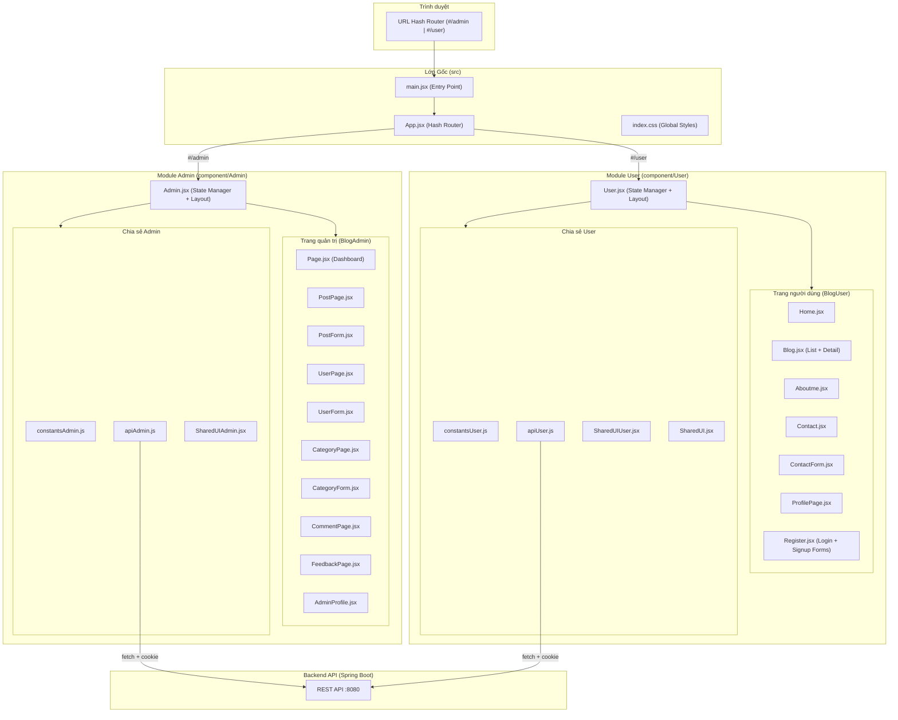

---

### 7.1 File gốc & Cấu hình dự án

| # | File | Vai trò | Đóng góp cho hệ thống |
|---|------|---------|----------------------|
| 1 | `package.json` | **File cấu hình dự án** Node.js. | Khai báo dependencies: React 19, ReactDOM 19, Lucide React (icon library), Vite 8 (build tool), plugin `@vitejs/plugin-react`. Định nghĩa scripts: `dev` (chạy dev server), `build` (build production), `preview` (xem bản build). |
| 2 | `vite.config.js` | **Cấu hình Vite** build tool. | Kích hoạt plugin `@vitejs/plugin-react` cho phép sử dụng JSX, Fast Refresh (HMR) trong quá trình phát triển. |
| 3 | `index.html` | **File HTML gốc** (entry point của Vite). | Chứa `<div id="root">` làm mount point cho React app và `<script>` trỏ tới `main.jsx`. Thiết lập meta viewport responsive và favicon. |
| 4 | `src/main.jsx` | **Điểm khởi chạy** (Entry Point) của React app. | Import `index.css` (global styles), render component `<App />` vào DOM element `#root` trong `StrictMode` để phát hiện lỗi tiềm ẩn. |
| 5 | `src/App.jsx` | **Hash Router trung tâm** — điều hướng toàn bộ ứng dụng. | Sử dụng `window.location.hash` để phân biệt `#/admin` (hiển thị module Admin) và `#/user` (hiển thị module User, mặc định). Cung cấp nút chuyển đổi nhanh Admin ↔ User ở góc dưới bên phải. Lắng nghe sự kiện `hashchange` để re-render khi URL thay đổi. |
| 6 | `src/index.css` | **Stylesheet toàn cục** — CSS chung cho toàn bộ app. | Reset margin/padding body. Định nghĩa responsive grid classes: `.category-grid` (5 cột → 3 cột → 1 cột), `.post-grid-4` (4 cột → 2 cột → 1 cột), `.post-grid-3` (3 cột → 2 cột → 1 cột) với breakpoints 1024px và 640px. Thiết lập placeholder cho `contenteditable` div (rich text editor). |

---

### 7.2 Module Admin — File chính (Package `component/Admin`)

| # | File | Vai trò | Đóng góp cho hệ thống |
|---|------|---------|----------------------|
| 7 | `Admin.jsx` | **Component gốc của module Quản trị** — quản lý toàn bộ state và layout Admin. | Đóng vai trò "App" cho phần Admin: (1) **Xác thực**: hiển thị form đăng nhập nếu chưa login, gọi `api.auth.me()` kiểm tra session; (2) **State tập trung**: quản lý state cho users, posts, categories, comments, feedbacks; (3) **Layout**: render Sidebar (menu điều hướng 6 mục + hồ sơ cá nhân) và Content Area; (4) **CRUD Handler**: chứa tất cả hàm xử lý tạo/sửa/xóa cho từng entity, gọi API và cập nhật state; (5) **Routing nội bộ**: dùng state `page` để hiển thị trang tương ứng (tổng-quan, người-dùng, bài-viết, bình-luận, danh-mục, đóng-góp). Lưu trang hiện tại vào `localStorage` để giữ lại khi refresh. |

---

### 7.3 Module Admin — Trang quản trị (Package `component/Admin/BlogAdmin`)

#### 7.3.1 Trang hiển thị dữ liệu

| # | File | Vai trò | Đóng góp cho hệ thống |
|---|------|---------|----------------------|
| 8 | `Page.jsx` | **Trang Tổng quan (Dashboard)** của Admin. | Hiển thị 4 thẻ thống kê (Người dùng, Bài viết, Danh mục, Bình luận) dạng card grid. Bên dưới là bảng danh sách bài viết gần đây có thanh tìm kiếm, hỗ trợ xem chi tiết / sửa / xóa bài viết. |
| 9 | `PostPage.jsx` | **Trang Quản lý bài viết** — danh sách + chi tiết. | Export 2 component: (1) `PostPage` — bảng danh sách bài viết với tìm kiếm, badge trạng thái (Đã xuất bản/Bản nháp), nút Thêm/Sửa/Xóa; (2) `PostDetailView` — xem chi tiết nội dung bài viết bao gồm tiêu đề, danh mục, tác giả, ngày tạo, nội dung HTML. |
| 10 | `UserPage.jsx` | **Trang Quản lý người dùng**. | Hiển thị bảng danh sách user với tìm kiếm, badge vai trò (Admin/User) và trạng thái, nút Thêm/Sửa/Xóa. |
| 11 | `CategoryPage.jsx` | **Trang Quản lý danh mục**. | Hiển thị bảng danh sách danh mục (ID, tên, slug) với tìm kiếm, nút Thêm/Sửa/Xóa. |
| 12 | `CommentPage.jsx` | **Trang Quản lý bình luận**. | Hiển thị bảng danh sách bình luận (nội dung, bài viết liên quan, người viết, ngày tạo) với tìm kiếm, nút Xóa. Admin chỉ xem và xóa bình luận, không chỉnh sửa. |
| 13 | `FeedbackPage.jsx` | **Trang Quản lý đóng góp ý kiến**. | Hiển thị bảng danh sách phản hồi từ khách truy cập (tên, email, chủ đề, nội dung, ngày gửi). Hỗ trợ tìm kiếm, xem chi tiết qua modal popup, xóa phản hồi đã xử lý. |
| 14 | `AdminProfile.jsx` | **Trang Hồ sơ cá nhân Admin**. | Hiển thị thông tin admin đang đăng nhập: avatar, username, email, vai trò (Quản trị viên/Nhân viên), ngày tạo tài khoản. Giao diện card với banner gradient. |

#### 7.3.2 Form nhập liệu (Modal)

| # | File | Vai trò | Đóng góp cho hệ thống |
|---|------|---------|----------------------|
| 15 | `PostForm.jsx` | **Form tạo/sửa bài viết** — trình soạn thảo nội dung phong phú. | Component form phức tạp nhất (~20KB): (1) Nhập tiêu đề, slug (tự động sinh từ tiêu đề), chọn danh mục; (2) **Rich Text Editor** tự xây dựng bằng `contenteditable` div — hỗ trợ bold, italic, underline, heading, danh sách, link, code block, căn lề; (3) Chế độ chuyển đổi giữa Visual Editor và HTML Source; (4) Toggle trạng thái Published/Draft; (5) Xử lý cả 2 mode: tạo mới và chỉnh sửa (load dữ liệu cũ). |
| 16 | `UserForm.jsx` | **Form tạo/sửa người dùng** (Modal). | Hộp thoại modal cho phép Admin: nhập username, email, password, chọn vai trò (Admin/User). Hỗ trợ 2 mode: thêm mới và chỉnh sửa (pre-fill dữ liệu cũ). Validation trước khi submit. |
| 17 | `CategoryForm.jsx` | **Form tạo/sửa danh mục** (Modal). | Hộp thoại modal cho phép Admin: nhập tên danh mục và slug. Hỗ trợ 2 mode: thêm mới và chỉnh sửa. |

#### 7.3.3 File chia sẻ (Shared)

| # | File | Vai trò | Đóng góp cho hệ thống |
|---|------|---------|----------------------|
| 18 | `constantsAdmin.js` | **Hằng số và dữ liệu mẫu** cho module Admin. | Export: (1) `COLORS` — bảng màu thiết kế (navy, blue, green, amber, red, purple + light variants); (2) `NAV_ITEMS` — danh sách menu sidebar Admin (6 mục: Tổng quan, Người dùng, Bài viết, Bình luận, Danh mục, Đóng góp); (3) Dữ liệu mẫu (INITIAL_USERS, INITIAL_POSTS, COMMENTS, CATEGORIES) dùng cho fallback khi chưa kết nối API. |
| 19 | `apiAdmin.js` | **Lớp gọi API** cho module Admin — cầu nối tới Backend. | Export object `api` chứa tất cả hàm gọi REST API: (1) `auth` — login, logout, me; (2) `dashboard` — getStats; (3) `users` — CRUD (getAll, getById, create, update, delete); (4) `posts` — CRUD; (5) `categories` — CRUD; (6) `comments` — getAll, delete; (7) `feedbacks` — getAll, delete. Mọi request đều đính kèm `credentials: "include"` để gửi cookie `JSESSIONID`. Tự động parse JSON response và ném Error khi status không OK. |
| 20 | `SharedUIAdmin.jsx` | **Thư viện UI components dùng chung** cho Admin. | Export các component nhỏ tái sử dụng: `Card` (khung card trắng), `PageNote` (ghi chú thông báo), `SearchInput` (thanh tìm kiếm), `Btn` (nút bấm), `IconBtn` (nút icon), `Th` / `Td` (ô tiêu đề/dữ liệu bảng), `statusBadge()` (badge trạng thái), `roleBadge()` (badge vai trò). Đảm bảo giao diện Admin nhất quán. |

---

### 7.4 Module User — File chính (Package `component/User`)

| # | File | Vai trò | Đóng góp cho hệ thống |
|---|------|---------|----------------------|
| 21 | `User.jsx` | **Component gốc của module Người dùng** — quản lý state và layout trang công khai. | Đóng vai trò "App" cho phần User: (1) **Khởi tạo**: gọi `userApi.auth.me()` kiểm tra session, load bài viết (`userApi.posts.getAll()`) và danh mục (`userApi.categories.getAll()`) từ API; (2) **State tập trung**: quản lý state cho posts, categories, currentUser, selectedPost, page navigation, search, filter; (3) **Mapping dữ liệu**: chuyển đổi dữ liệu API thành format hiển thị (thêm excerpt, tagColor, date format, read time); (4) **Layout**: render NavBar (trên), nội dung trang (giữa), Footer (dưới) + modal Login/Signup; (5) **Routing nội bộ**: dùng state `page` để điều hướng 6 trang (home, blog, blog-detail, about, contact, profile). |

---

### 7.5 Module User — Trang người dùng (Package `component/User/BlogUser`)

#### 7.5.1 Trang hiển thị

| # | File | Vai trò | Đóng góp cho hệ thống |
|---|------|---------|----------------------|
| 22 | `Home.jsx` | **Trang Chủ** — landing page của blog. | Hiển thị: (1) Grid danh mục với icon tương ứng (Code2, Cpu, Shield, Terminal), click vào chuyển sang trang Blog lọc theo danh mục; (2) Grid bài viết mới nhất dưới dạng PostCard; (3) Form liên hệ nhanh (ContactForm mini) ở cuối trang. |
| 23 | `Blog.jsx` | **Trang Blog** — danh sách bài viết + chi tiết bài viết. | Export 2 component: (1) `BlogPage` — danh sách bài viết với bộ lọc danh mục (filter tabs), thanh tìm kiếm, phân trang (pagination), sidebar danh mục phổ biến; (2) `BlogDetailPage` — chi tiết bài viết: render nội dung HTML (hỗ trợ heading, list, code block, link), hiển thị tác giả, ngày đăng, thời gian đọc. Tích hợp hệ thống bình luận (xem + gửi bình luận nếu đã đăng nhập). Có nút copy link, like, share. Hỗ trợ `formatPostContent()` chuyển text thô thành HTML có cấu trúc. |
| 24 | `Aboutme.jsx` | **Trang Giới thiệu** — thông tin tác giả blog. | Component tĩnh hiển thị card giới thiệu tác giả (tên, mô tả, icon chuyên ngành: Code2, Terminal, Cpu). |
| 25 | `Contact.jsx` | **Trang Liên hệ** — form gửi tin nhắn + thông tin liên hệ. | Hiển thị 2 cột: (1) Danh sách thông tin liên hệ (Email, Địa chỉ, GitHub, LinkedIn) với icon SVG tùy chỉnh; (2) Component `ContactForm` để gửi phản hồi. |
| 26 | `ContactForm.jsx` | **Form gửi phản hồi/liên hệ** — component tái sử dụng. | Form gửi feedback tới API (`userApi.feedbacks.submit()`): (1) Nếu user đã đăng nhập → tự động điền name/email từ `currentUser`; (2) Nếu chưa đăng nhập → yêu cầu nhập thủ công; (3) Validation đầy đủ, hiển thị thông báo lỗi/thành công; (4) Hỗ trợ mode mini (dùng trong trang Home) và mode full (dùng trong trang Contact). |
| 27 | `ProfilePage.jsx` | **Trang Hồ sơ cá nhân** — xem và chỉnh sửa thông tin user. | Trang phức tạp (~18KB): (1) **Xem profile**: hiển thị avatar, username, email, vai trò, ngày tạo tài khoản dưới dạng card có banner; (2) **Chỉnh sửa**: toggle chế độ edit cho phép cập nhật username, email, password mới (gọi `userApi.profile.update()`); (3) **Đăng xuất**: nút logout gọi callback `onLogout`; (4) Quản lý state loading, saving, message (success/error) riêng. |

#### 7.5.2 Form xác thực

| # | File | Vai trò | Đóng góp cho hệ thống |
|---|------|---------|----------------------|
| 28 | `Register.jsx` | **Form Đăng nhập + Đăng ký** — 2 component trong 1 file. | Export 2 component: (1) `LoginForm` — form nhập username/password, gọi `userApi.auth.login()`, callback `onLoginSuccess` cập nhật currentUser, link chuyển sang form đăng ký; (2) `SignupForm` — form nhập username, email, password, xác nhận password, gọi `userApi.auth.register()`, validation (không rỗng, password ≥ 6 ký tự, xác nhận khớp). Cả 2 form đều hiển thị trong modal overlay. |

#### 7.5.3 File chia sẻ (Shared)

| # | File | Vai trò | Đóng góp cho hệ thống |
|---|------|---------|----------------------|
| 29 | `constantsUser.js` | **Hằng số thiết kế và dữ liệu mẫu** cho module User. | Export: (1) `c` — bảng màu sáng (bg, card, border, text, blue, green, purple); (2) `dk` — bảng màu tối (dark mode, dự phòng); (3) `cats` — danh mục mẫu với icon Lucide tương ứng; (4) `posts` — bài viết mẫu; (5) `catFilterMap` — ánh xạ tên danh mục DB → filter label; (6) `filters` — danh sách tab bộ lọc (Tất cả, Web, AI, Cyber Security, Linux, Programming). |
| 30 | `apiUser.js` | **Lớp gọi API** cho module User — cầu nối tới Backend. | Export object `userApi` chứa tất cả hàm gọi REST API: (1) `auth` — login, register, logout, me; (2) `posts` — getAll, getById, getBySlug, search, getByCategory; (3) `categories` — getAll; (4) `comments` — getByPost, create; (5) `profile` — get, update; (6) `feedbacks` — submit. Mọi request đều đính kèm `credentials: "include"` để gửi cookie `JSESSIONID`. Tự động serialize body thành JSON và parse response. |
| 31 | `SharedUIUser.jsx` | **Thư viện UI components dùng chung** cho module User. | Export các component: (1) `Tag` — nhãn danh mục nhỏ với màu; (2) `PostCard` — card bài viết (icon, tag, tiêu đề, excerpt, ngày, thời gian đọc); (3) `NavBar` — thanh điều hướng trên cùng (logo, menu 4 mục: Trang chủ, Blog, Về tôi, Liên hệ, thanh tìm kiếm, nút Đăng nhập hoặc avatar user); (4) `Footer` — chân trang (logo, danh mục, liên kết nhanh, bản quyền); (5) `LoginModal` / `SignupModal` — overlay modal chứa LoginForm/SignupForm. Icon tự động gán theo tên danh mục. |
| 32 | `SharedUI.jsx` | **File UI cũ (legacy)** — phiên bản trước của SharedUIUser. | Chứa component `LoginModal` và `SignupModal` tương tự SharedUIUser nhưng import từ `constants` (cũ). Hiện tại là file dự phòng, chức năng đã được chuyển sang `SharedUIUser.jsx`. |
